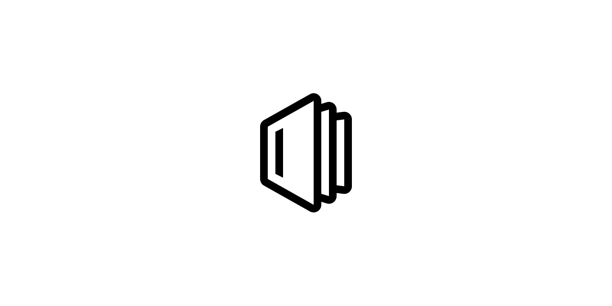

# 📚 [Outline](https://github.com/outline/outline) с русским переводом [](https://github.com/flameshikari/outline-ru/actions) [](https://github.com/flameshikari/outline-ru/releases/latest)

## ❓ Зачем

Поддержка русского языка в [Outline](https://github.com/outline/outline) прекращена в версии [0.71.0](https://github.com/outline/outline/releases/tag/v0.71.0) по [некоторым причинам](https://github.com/outline/outline/discussions/5706).

## 📝 Примечания

За основу взят перевод из [данного коммита](https://github.com/outline/outline/commit/228d1faa9fd3cbb82409d98e1443fed65adc5715), который впоследствии улучшается и переводится здесь.

Буду рад помощи в улучшении перевода или сборки; сообщить о некорректном переводе можно [здесь](https://github.com/flameshikari/outline-ru/discussions/8).

Из доступных архитектур контейнера имеются только `amd64` и `arm64`.

## 🐳 Установка

Всё по [официальной инструкции](https://docs.getoutline.com/s/hosting/doc/docker-7pfeLP5a8t), только в качестве `image` нужно использовать `flameshikari/outline-ru:latest` или `ghcr.io/flameshikari/outline-ru:latest`.
Вместо `latest` желательно указать версию; доступные смотреть [здесь](https://github.com/flameshikari/outline-ru/tags).

Также укажите `DEFAULT_LANGUAGE=ru_RU` в [docker.env](https://github.com/outline/outline/blob/main/.env.sample) или в `environments` (в зависимости от вашей конфигурации).

```yaml
  ...

  outline:
    image: flameshikari/outline-ru:latest
    env_file: ./docker.env
    ports:
      - "3000:3000"
    volumes:
      - storage-data:/var/lib/outline/data
    depends_on:
      - postgres
      - redis

  ...
```
